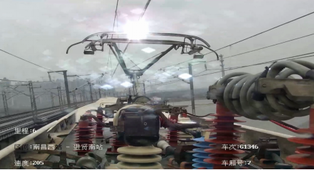
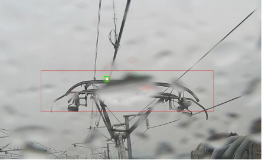
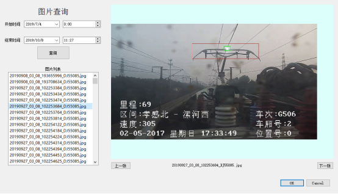

<title>受电弓安全状态检测系统说明文档</title>

# 受电弓安全状态检测系统说明文档

西安恒景通视觉科技有限责任公司

2019年10月

## 1. 公司简介

**西安恒景通视觉科技有限公司**是一家以互联网为载体，面向全国，提供人工智能与计算机视觉软硬件综合服务平台的高科技研发公司。公司现有研发人员70余人，具有较强的科研开发能力，特别是在智能图像信息处理软件领域具有独特的开发能力。科研领军人物是4名具有英美留学背景的海归博士。公司拥有一批高素质、专业化的博士后、博士、硕士研究生人才队伍，本着一流的服务意识，客户之上、用户第一的宗旨，竭诚为客户服务。
**受电弓安全状态检测产品由西安恒景通视觉科技有限公司与西安交通大学科研团队联合开发**，经过近年来的用户测试与验证，产品应用在国内多家科研院所与企业，并获得广泛好评，是目前世界上最先进的受电弓安全状态检测实时处理解决方案。

## 2. 受电弓安全状态检测原理

受电弓安全状态检测是基于大数据与深度学习的人工智能算法，实现对受电弓安全状态的准确检测。本产品采用多年项目积累收集到的超过800G视频数据，并对视频数据进行整理、预处理和分析，实现对20多万张数据的标注和训练，得到最优的算法模型。
本产品提出的基于深度学习目标识别的方法分为三个阶段：首先在给定的图像上选择一些候选的区域，然后对这些区域提取特征，最后使用训练的分类器进行分类。下面对这三个阶段分别进行介绍。

1) 区域选择
这一步是为了对目标的位置进行定位。由于目标可能出现在图像的任何位置，而且目标的大小、长宽比例也不确定，所以采用滑动窗口的策略对整幅图像进行遍历，而且通过设置不同的尺度，不同的长宽比，可以包含目标所有可能出现的位置。
2) 特征提取
由于目标的形态多样性，光照变化多样性，背景多样性等因素使得设计一个鲁棒的特征并不是那么容易。然而提取特征的好坏直接影响到分类的准确性，本产品采用具有不变特性的结构化特征。
3) 分类器
本产品研究了结合深度学习和稀疏编码，解决了目标的识别与检测问题，采用多级分类器结构，提出一种基于迁移自学习的目标快速识别分类方法。

本产品的深度学习模型如图1所示，将目标识别与检测任务转换成一个回归问题，大大加快检测的速度，使得网络模型可以实时处理视频图像。不仅利用高层特征的语义信息，还考虑了低层特征的细节纹理信息，使得目标检测定位更为精准。

## 3. 受电弓安全状态检测产品简介

高铁受电弓实时智能监测与预警功能如图2-3所示。

点击主界面“图片查询”按钮即可进行图片查询。询时点击左侧选择开始时间和结束时间并点击“查询”按钮即可进行图片查询。

## 4. 测试视频
以下是测试视频

<video width="320" height="240" controls="controls" style="text-align:center">
  <source src="./1.mp4" type="video/mp4" />
</video> 
<video width="320" height="240" controls="controls"style="text-align:center">
  <source src="2.mp4" type="video/mp4" />
</video> 
<video width="320" height="240" controls="controls" style="text-align:center">
  <source src="3.mp4" type="video/mp4" />
</video> 

